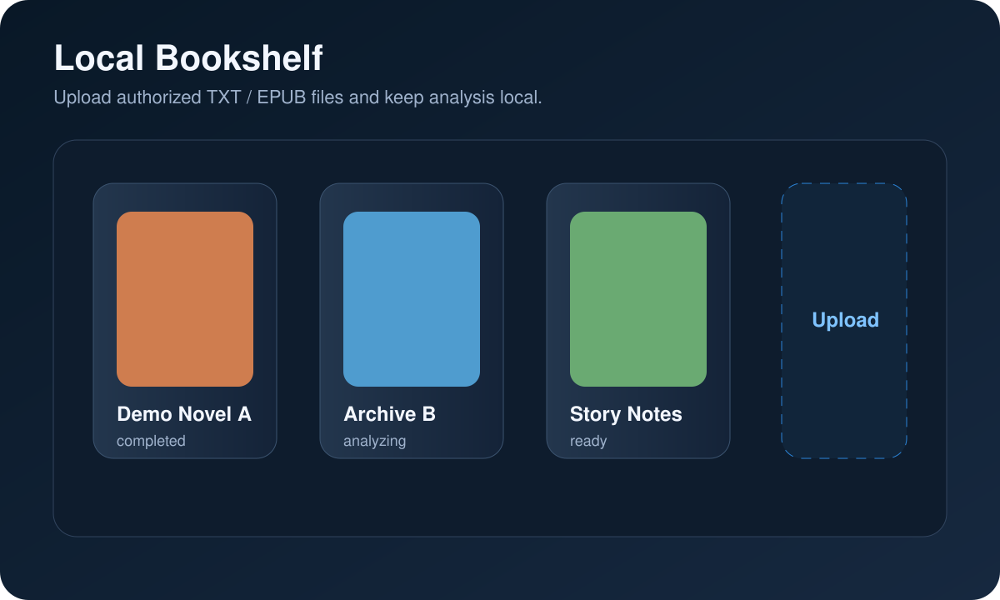
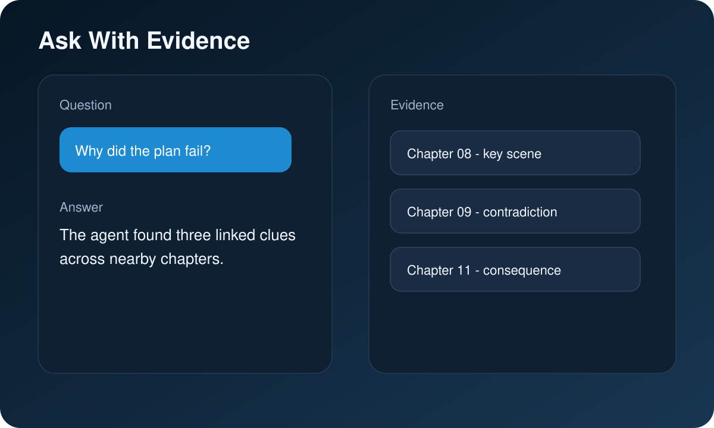
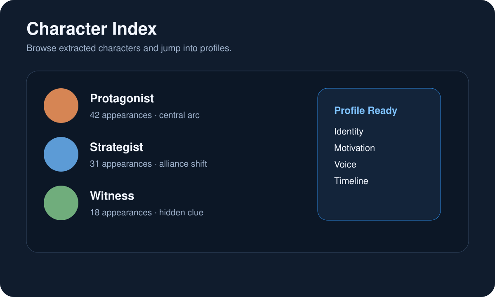
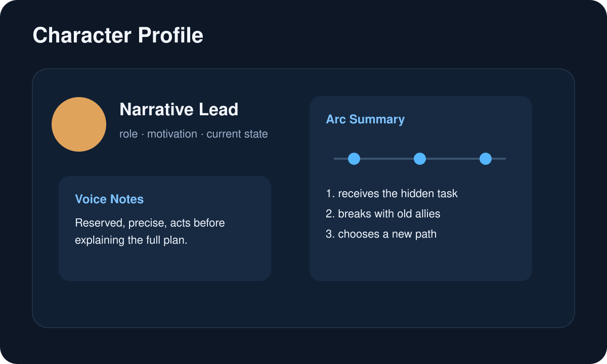
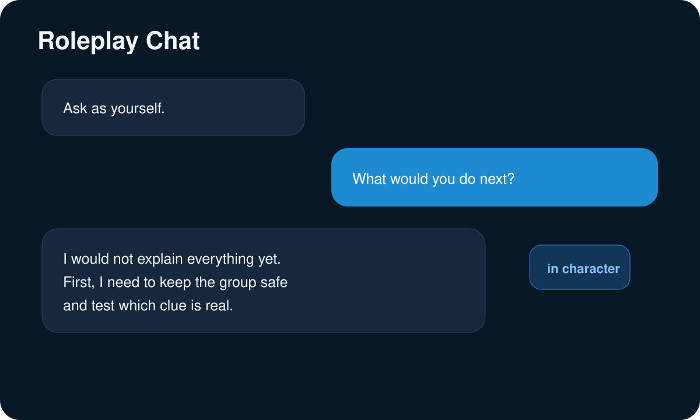
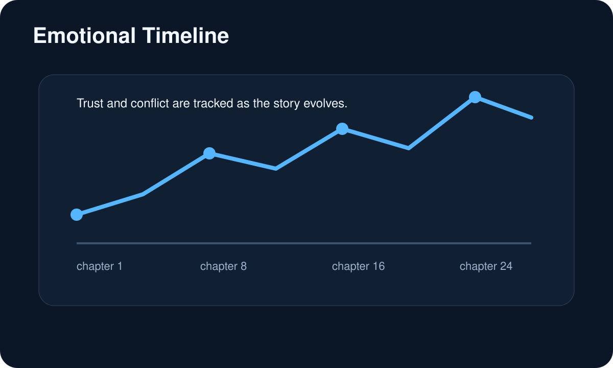
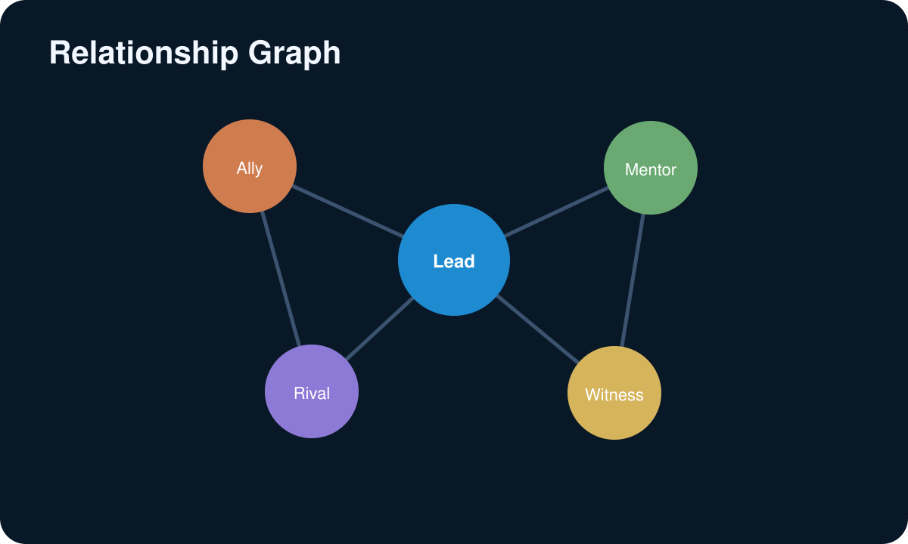

# Story2Memory

本地小说分析工作台。上传你有权处理的 `txt` / `epub`，完成检索问答、证据追踪、人物画像、关系网络与角色扮演对话。

[](./LICENSE) [](https://www.docker.com/) [](#quick-start)

[Showcase](#showcase) · [Quick Start](#quick-start) · [First-Run Config](#first-run-config) · [Manual Config](#manual-config) · [Open-Source Boundary](#open-source-boundary)

## Why

Story2Memory 把一部小说整理成可检索、可追问、可扮演的本地知识工作台。默认仅本机访问，适合在自己的机器上处理有权使用的文本。

## Features

| 能力 | 说明 |
| --- | --- |
| 本地书库 | 上传 `txt` / `epub`，按书籍管理分析结果 |
| Agent 问答 | 围绕整本书提问，并返回章节级 evidence |
| 人物画像 | 自动整理身份、动机、语言风格、剧情轨迹 |
| 关系网络 | 展示人物、情感与事件之间的关联 |
| 角色扮演 | 基于角色档案和关系记忆进行对话 |
| Docker 部署 | MySQL、Neo4j、Qdrant、Redis 统一编排 |

## Showcase

以下为匿名演示界面，不包含第三方小说正文、封面或真实数据。

| 本地书架 | 证据问答 |
| --- | --- |
|  |  |

| 角色档案 | 人物画像 |
| --- | --- |
|  |  |

| 角色扮演 | 情感时间线 |
| --- | --- |
|  |  |



## Quick Start

```bash
cp .env.example .env
```

编辑 `.env`，至少替换：

- `MYSQL_ROOT_PASSWORD`
- `MYSQL_PASSWORD`
- `NEO4J_PASSWORD`

启动：

```bash
docker compose up --build
```

打开：

- `http://127.0.0.1:3000`
- `http://127.0.0.1:8000/_health`

首页按顺序操作：`刷新状态`、`测试配置`、`开始使用`。

## First-Run Config

首启页会要求填写并测试这些模型配置：

| 字段 | 用途 | 默认 URL |
| --- | --- | --- |
| `ARK_API_KEY` | 火山引擎 Ark API Key | - |
| `LLM_MODEL` | 问答、总结、推理模型 | `https://ark.cn-beijing.volces.com/api/coding/v3` |
| `EMBED_MODEL` | 向量检索模型 | `https://ark.cn-beijing.volces.com/api/v3` |
| `RERANK_API_KEY` | rerank API Key | - |
| `RERANK_MODEL` | 默认 `qwen3-rerank` | `https://dashscope.aliyuncs.com/compatible-api/v1/reranks` |

首启测试通过后，配置会写入本地 `data/config/runtime.env`。该文件已被 `.gitignore` 排除。

## Manual Config

如果直接编辑 `.env` 或 `data/config/runtime.env`，常用字段如下：

- `LLM_MODEL` 填你的 Ark Coding Plan 模型名
- `EMBED_MODEL` 填你的 Ark embedding endpoint，例如 `ep-...`
- `RERANK_PROVIDER=qwen`
- `RERANK_BASE_URL=https://dashscope.aliyuncs.com/compatible-api/v1/reranks`
- `RERANK_MODEL=qwen3-rerank`
- `AGENT_RUNTIME_PREWARM_ENABLED=0` 表示默认不预热 agent 运行时
- 默认会由 `MYSQL_USER`、`MYSQL_PASSWORD`、`MYSQL_DATABASE`、`MYSQL_HOST`、`MYSQL_PORT` 自动生成 `MYSQL_DSN`

## Open-Source Boundary

- 仓库只发布代码，不发布内容数据
- 用户自行上传有权处理的文本或电子书
- 不附带任何小说正文、封面或演示数据
- 默认仅本机访问
- `.env`、`data/config/`、`data/book/`、`data/picture/` 不进入 Git
- `output/` 数据集与实验产物不进入 Git 与 Docker 构建上下文
- 当前公开版首启默认使用火山引擎 Ark + Qwen rerank 兼容接口

代码以 [MIT](./LICENSE) 许可证发布，但不授予任何第三方小说内容的再分发权。

## Troubleshooting

```bash
docker compose ps
docker compose logs -f app
pytest -q
bash scripts/ci_public_smoke.sh
```

模型测试失败时，优先检查 `ARK_API_KEY`、`LLM_MODEL`、`EMBED_MODEL`、`RERANK_API_KEY`、`RERANK_BASE_URL`、`RERANK_MODEL` 是否可用。
